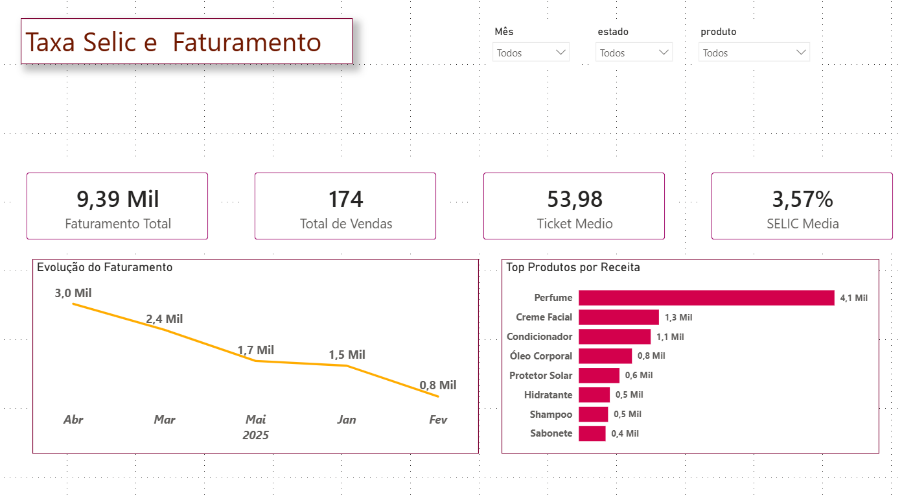
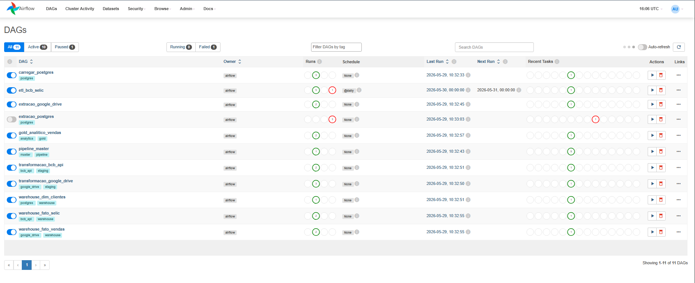

# Projeto de Engenharia de Dados — Pipeline ETL com Airflow, PostgreSQL e Power BI

## Dashboard Power BI



---

## Orquestração com Airflow



---

## Objetivo do Projeto

Este projeto foi desenvolvido para simular um ambiente real de Engenharia de Dados, utilizando um pipeline ETL completo com múltiplas fontes de dados, processamento em camadas e visualização analítica.

O objetivo foi construir uma arquitetura escalável para ingestão, transformação, armazenamento e análise de dados utilizando ferramentas amplamente utilizadas pelo mercado.

---

## Arquitetura do Projeto

Fluxo do pipeline:

**Fontes de Dados → Bronze → Staging → Warehouse → Gold → Power BI**

### Fontes de Dados Utilizadas

* API do Banco Central (SELIC)
* PostgreSQL
* Google Drive (arquivos CSV)

---

## Tecnologias Utilizadas

* Python
* Apache Airflow
* Docker
* PostgreSQL
* SQLAlchemy
* Pandas
* Power BI
* Git / GitHub

---

## Estrutura do Projeto

```txt
treino_data_engineer/
│
├── dags/                  # DAGs do Airflow
├── scripts/               # Scripts ETL
├── raw/                   # Camada Bronze
├── staging/               # Camada Silver
├── warehouse/             # Data Warehouse
├── gold/                  # Camada analítica
├── dashboard/             # Dashboard Power BI
├── docker/                # Docker Compose
├── credentials/           # Credenciais locais
│
├── requirements.txt
├── .gitignore
└── README.md
```

---

## Pipeline de Dados

### Extração

Os dados são coletados automaticamente através do Apache Airflow a partir de diferentes fontes:

* API Banco Central (SELIC)
* Base PostgreSQL
* Arquivos CSV do Google Drive

### Transformação

Os dados passam por etapas de limpeza e padronização:

* Tratamento de tipos
* Padronização textual
* Remoção de duplicidades
* Criação de fatos e dimensões
* Construção da camada Gold analítica

### Armazenamento

Os dados transformados são armazenados no PostgreSQL em formato analítico:

**Tabelas principais:**

* `dim_clientes`
* `fato_vendas`
* `fato_selic`
* `gold_analitico_vendas`

---

## Dashboard Power BI

O dashboard apresenta:

* KPI de faturamento
* Ticket médio
* Evolução temporal de vendas
* Produtos com maior receita
* Análise integrada com taxa SELIC

Arquivo:

`dashboard/dashboard_analise_vendas.pbix`

---

## Aprendizados do Projeto

Durante o desenvolvimento foram praticados conceitos de:

* Engenharia de Dados
* ETL/ELT
* Orquestração de pipelines
* Dockerização
* Modelagem dimensional
* Integração Power BI + PostgreSQL
* Arquitetura Bronze → Silver → Gold

---

## Próximos Passos

* Migração PostgreSQL → BigQuery
* Implementação com dbt
* Deploy em nuvem
* Monitoramento avançado do pipeline
